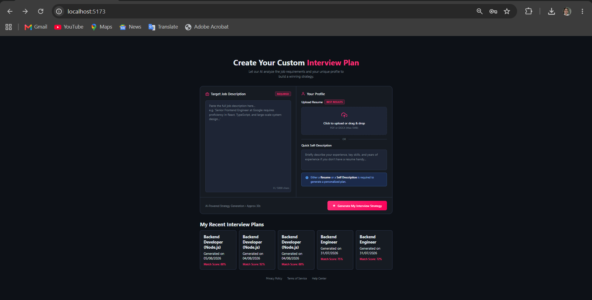
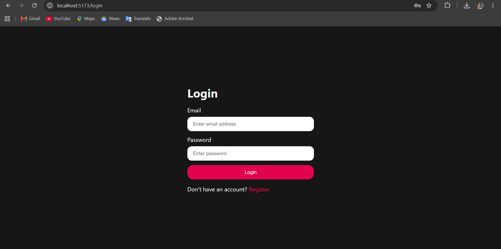

# 🚀 AI Resume Analyzer & Interview Generator

An AI-powered full-stack web application that analyzes resumes, compares them with job descriptions, generates personalized interview questions, identifies skill gaps, and creates an ATS-friendly optimized resume PDF.

Built using the MERN stack with Google Gemini AI.

---

## ✨ Features

### 🔐 Authentication

- JWT Authentication
- Secure Cookie-based Sessions
- User Registration & Login
- Protected Routes
- Logout Functionality

### 📄 Resume Analysis

- Upload Resume (PDF)
- Paste Job Description
- Optional Self Description
- AI-powered Resume Parsing
- Match Score Generation
- Skill Gap Analysis

### 💼 Interview Preparation

- Personalized Technical Questions
- Behavioral Interview Questions
- Learning Roadmap
- Model Answers
- Interview Intent Explanation

### 📑 Resume Generator

- AI-generated ATS-friendly Resume
- Download Resume as PDF
- Professional Resume Formatting

### 📊 Dashboard

- View Previous Interview Reports
- Access Generated Reports Anytime
- Resume Download from Previous Reports

---

# 🛠 Tech Stack

## Frontend

- React.js
- React Router
- SCSS
- Axios
- Context API

## Backend

- Node.js
- Express.js
- MongoDB
- Mongoose
- JWT Authentication
- Cookie Parser
- Multer

## AI

- Google Gemini API

## PDF Generation

- Puppeteer

---

# 📂 Project Structure

```
resume-analyser/
│
├── Frontend/
│   ├── src/
│   │   ├── features/
│   │   │   ├── auth/
│   │   │   └── interview/
│   │   ├── App.jsx
│   │   └── app.routes.jsx
│   │
│   └── package.json
│
├── Backend/
│   ├── src/
│   │   ├── controllers/
│   │   ├── routes/
│   │   ├── services/
│   │   ├── middlewares/
│   │   ├── config/
│   │   └── models/
│   │
│   └── package.json
│
└── README.md
```

---

# ⚙️ Installation

## Clone Repository

```bash
git clone https://github.com/Nandini09varsha/resume-analyser.git
```

```
cd resume-analyser
```

---

## Backend

```
cd Backend
npm install
```

Create a `.env` file.

```
PORT=3000

MONGO_URI=YOUR_MONGODB_URI

JWT_SECRET=YOUR_SECRET_KEY

GOOGLE_API_KEY=YOUR_GEMINI_API_KEY
```

Run Backend

```
npm run dev
```

---

## Frontend

```
cd Frontend
npm install
```

Run Frontend

```
npm run dev
```

Application runs on

```
Frontend:
http://localhost:5173

Backend:
http://localhost:3000
```

---

# 📸 Screenshots

## Home Page



---

## Login



---

## Resume Analyzer


---

## Interview Report


---

## Resume PDF


---

# 📌 API Endpoints

## Authentication

| Method | Endpoint           |
| ------ | ------------------ |
| POST   | /api/auth/register |
| POST   | /api/auth/login    |
| GET    | /api/auth/logout   |
| GET    | /api/auth/get-me   |

---

## Interview

| Method | Endpoint                      |
| ------ | ----------------------------- |
| POST   | /api/interview/generate       |
| GET    | /api/interview                |
| GET    | /api/interview/:id            |
| POST   | /api/interview/resume/pdf/:id |

---

# 🔒 Security Features

- Password Hashing using bcrypt
- JWT Authentication
- HTTP-only Cookies
- Protected Backend Routes
- Token Blacklisting on Logout

---

# 💡 Future Improvements

- AI Resume Suggestions
- Cover Letter Generator
- Voice Mock Interviews
- ATS Score Visualization
- Company-specific Interview Sets
- Resume Version History
- Multi-language Resume Generation

---

# 👨‍💻 Author

**Nandini Verma**

GitHub:
https://github.com/Nandini09varsha

LinkedIn:
https://www.linkedin.com/in/nandini-verma/

---

## ⭐ If you found this project useful, consider giving it a star!
